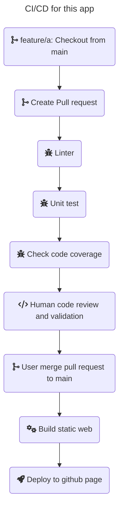

# Caesar with password
Live: https://luatnd.github.io/caesar-password/

Simple deterministic encryption by combining caesar cipher with password


# About
Note: This project use new `app` directory structure of NextJs 13 instead of `pages` as in the older versions.
In this new `app` dir structure, each path to `page.tsx` is a valid route.

# Dev
To run on dev mode:
```
yarn
yarn dev
```
Open [http://localhost:3000](http://localhost:3000) with your browser to see the result.

# Test
Run unit test
```
yarn test
```

# Run prod mode
To run on prod mode:
```
yarn build
yarn start
```

# CI-CD


# Component structure
This project use default NextJs structure.

And some custom structure:
```
app
|— components
   |— MyCom
      |- index.tsx    // (or comp name) is the presentation view layer
      |- model.ts     // DTO layer: DTO or types, we often import this from GraphQL codegen
      |- service.ts   // biz layer: biz logic and hooks
      |- dao.ts       // DAO layer (data fetching layer): fetch data from REST, socket, localstorage, ...
      |- store.ts     // for sharing state with other components
      |- components   // sub components: for internal use only
      |- other-utils.ts // sth else
      |— MyOtherComponent.tsx      // Another simple component
|— services           // app-wide services
|— utils              // app-wide utils
```

# Boilerplate

- Next.js 13
- TypeScript
- Material UI
- Tailwind
- ESLint
- Prettier
